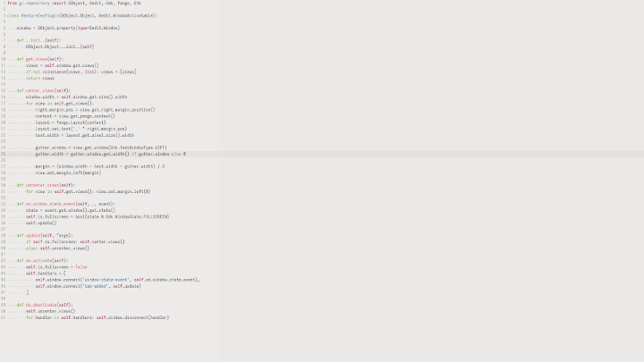
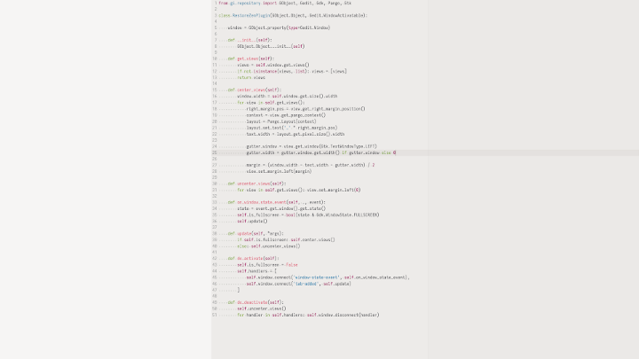

# Restore Zen (gedit plugin)

Before:



After:



## Features

* In gedit 3.36, zen mode (centering the view when in fullscreen) is removed
* This plugin allows you to have zen mode
* Optional: you can choose to enable wrapping at right margin in preferences

## Installation

```bash
mkdir -p ~/.local/share/gedit/plugins/
cd ~/.local/share/gedit/plugins/
git clone https://github.com/johnfactotum/gedit-restore-zen.git restore-zen
```

## Known Issues

* Breaks when you have multiple tab groups open
* Left margin is not colored with color scheme colors, which can be odd

## See also

* [Restore Overlay Scrolling](https://github.com/johnfactotum/gedit-restore-overlay-scrolling) - plugin for restoring overlay scrolling, which was also removed in gedit 3.36
* [Restore Minimap](https://github.com/johnfactotum/gedit-restore-minimap) - plugin for restoring the minimap, which was also removed in gedit 3.36
